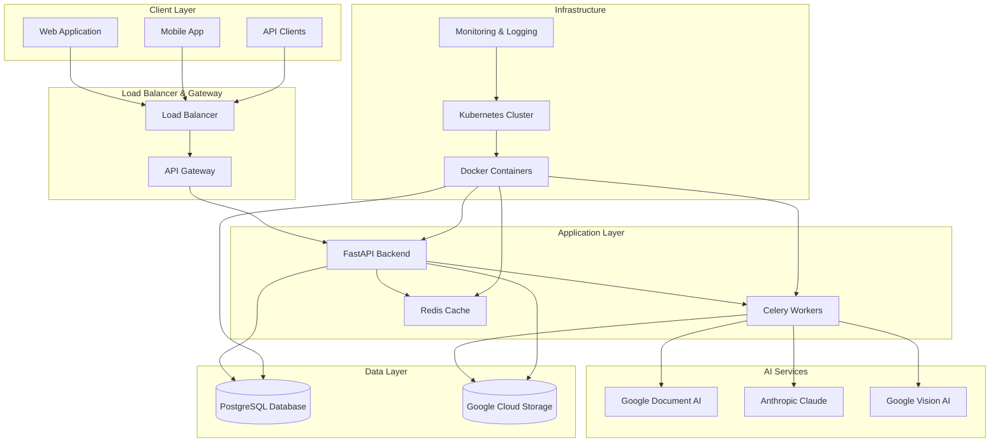
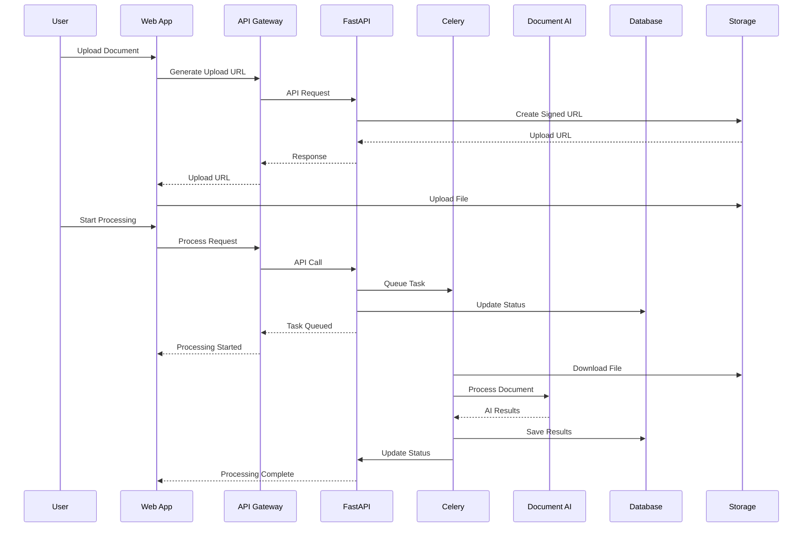
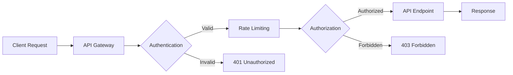
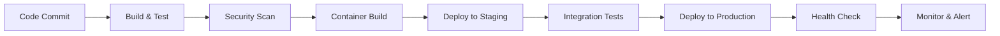

# Brant Roofing System - Architecture Overview

## 🏗️ System Architecture Diagram



## 🔧 Component Details

### **Frontend Layer**

- **Web Application**: React-based responsive web interface
- **Mobile App**: Native mobile applications (iOS/Android)
- **API Clients**: Third-party integrations and custom applications

### **API Gateway & Load Balancing**

- **Load Balancer**: Distributes traffic across multiple backend instances
- **API Gateway**: Request routing, authentication, and rate limiting
- **SSL Termination**: Secure HTTPS communication

### **Application Services**

- **FastAPI Backend**: Main application server with async processing
- **Celery Workers**: Background task processing for AI operations
- **Redis Cache**: High-speed caching for frequently accessed data

### **Data Storage**

- **PostgreSQL**: Primary database for structured data
- **Google Cloud Storage**: Document and file storage
- **Redis**: Session storage and caching

### **AI Processing Services**

- **Google Document AI**: Document parsing and OCR
- **Anthropic Claude**: Natural language processing
- **Google Vision AI**: Image analysis and recognition

## 🔄 Data Flow Architecture



## 🏛️ Database Architecture

### **Core Tables**

```sql
-- Projects table
CREATE TABLE projects (
    id UUID PRIMARY KEY,
    name VARCHAR(255) NOT NULL,
    client_info JSON,
    created_at TIMESTAMP DEFAULT NOW()
);

-- Documents table
CREATE TABLE documents (
    id UUID PRIMARY KEY,
    project_id UUID REFERENCES projects(id),
    filename VARCHAR(255) NOT NULL,
    file_path VARCHAR(500) NOT NULL,
    processing_status processing_status_enum DEFAULT 'pending',
    created_at TIMESTAMP DEFAULT NOW()
);

-- Measurements table
CREATE TABLE measurements (
    id UUID PRIMARY KEY,
    document_id UUID REFERENCES documents(id),
    area_sf FLOAT NOT NULL,
    confidence_score FLOAT NOT NULL,
    measurement_type VARCHAR(50),
    created_at TIMESTAMP DEFAULT NOW()
);
```

### **Indexes for Performance**

- `ix_document_status` on `documents.processing_status`
- `ix_document_created` on `documents.created_at`
- `ix_measurement_document` on `measurements.document_id`
- `ix_measurement_type` on `measurements.measurement_type`

## 🔐 Security Architecture

### **Authentication & Authorization**



### **Security Layers**

1. **Network Security**: VPC with private subnets
2. **Application Security**: JWT tokens and role-based access
3. **Data Security**: Encryption at rest and in transit
4. **API Security**: Rate limiting and input validation
5. **Infrastructure Security**: Container security and secrets management

## 📊 Monitoring & Observability

### **Monitoring Stack**

- **Application Metrics**: Prometheus + Grafana
- **Log Aggregation**: ELK Stack (Elasticsearch, Logstash, Kibana)
- **Distributed Tracing**: Jaeger for request tracing
- **Health Checks**: Kubernetes health probes
- **Alerting**: PagerDuty integration

### **Key Metrics**

- **Performance**: Response time, throughput, error rate
- **Business**: Documents processed, accuracy rate, user activity
- **Infrastructure**: CPU, memory, disk usage, network I/O
- **Security**: Failed logins, suspicious activity, API abuse

## 🚀 Deployment Architecture

### **Container Orchestration**

```yaml
# Kubernetes Deployment Example
apiVersion: apps/v1
kind: Deployment
metadata:
  name: brant-api
spec:
  replicas: 3
  selector:
    matchLabels:
      app: brant-api
  template:
    spec:
      containers:
      - name: api
        image: brant-roofing:latest
        ports:
        - containerPort: 8080
        env:
        - name: DATABASE_URL
          valueFrom:
            secretKeyRef:
              name: brant-secrets
              key: database-url
```

### **Scaling Strategy**

- **Horizontal Pod Autoscaler**: Auto-scale based on CPU/memory
- **Vertical Pod Autoscaler**: Optimize resource allocation
- **Cluster Autoscaler**: Scale cluster nodes as needed
- **Database Scaling**: Read replicas and connection pooling

## 🔄 CI/CD Pipeline

### **Deployment Pipeline**



### **Quality Gates**

- **Code Quality**: SonarQube analysis
- **Security**: OWASP dependency check
- **Testing**: Unit, integration, and E2E tests
- **Performance**: Load testing and benchmarks
- **Compliance**: Security and privacy audits

---

**Last Updated**: January 2025  
**Version**: 1.0.0  
**Document Owner**: Brant Roofing System Development Team
