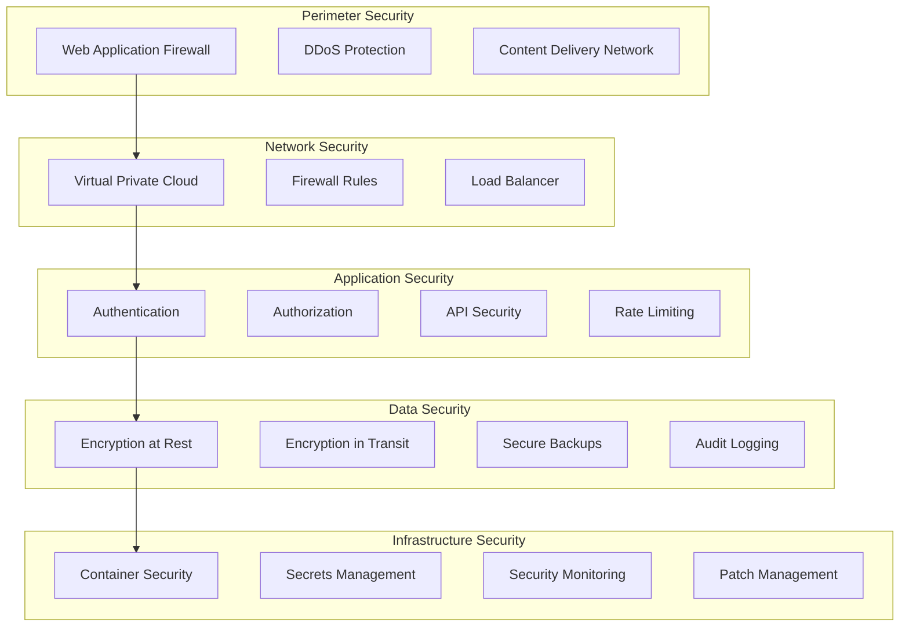

# Brant Roofing System - Security & Compliance

## 🔒 Security Overview

The Brant Roofing System implements enterprise-grade security measures to protect sensitive data, ensure system integrity, and maintain regulatory compliance across all aspects of the platform.

## 🛡️ Security Architecture

### **Defense in Depth Strategy**



### **Security Layers**

#### **1. Perimeter Security**

- **Web Application Firewall (WAF)**: Protects against OWASP Top 10 attacks
- **DDoS Protection**: Mitigates distributed denial-of-service attacks
- **CDN Security**: Content delivery with built-in security features
- **SSL/TLS Termination**: End-to-end encryption for all communications

#### **2. Network Security**

- **Virtual Private Cloud (VPC)**: Isolated network environment
- **Firewall Rules**: Restrictive inbound/outbound traffic rules
- **Load Balancer**: Secure traffic distribution with health checks
- **Network Segmentation**: Separate networks for different tiers

#### **3. Application Security**

- **Multi-Factor Authentication (MFA)**: Enhanced user authentication
- **Role-Based Access Control (RBAC)**: Granular permission management
- **API Security**: Rate limiting, input validation, and authentication
- **Session Management**: Secure session handling with timeouts

#### **4. Data Security**

- **Encryption at Rest**: AES-256 encryption for all stored data
- **Encryption in Transit**: TLS 1.3 for all data transmission
- **Secure Backups**: Encrypted backups with access controls
- **Data Masking**: Sensitive data protection in non-production environments

## 🔐 Authentication & Authorization

### **Authentication Methods**

#### **Primary Authentication**

```yaml
# JWT Token Configuration
jwt:
  algorithm: "HS256"
  secret_key: "${SECRET_KEY}"
  access_token_expire_minutes: 30
  refresh_token_expire_days: 7
  
# Password Requirements
password_policy:
  min_length: 8
  require_uppercase: true
  require_lowercase: true
  require_numbers: true
  require_special_chars: true
  max_age_days: 90
```

#### **Multi-Factor Authentication (MFA)**

- **TOTP (Time-based One-Time Password)**: Google Authenticator, Authy
- **SMS Verification**: Backup authentication method
- **Email Verification**: Account recovery and notifications
- **Hardware Tokens**: FIDO2/WebAuthn support for enterprise users

### **Authorization Framework**

#### **Role-Based Access Control (RBAC)**

```yaml
# User Roles and Permissions
roles:
  admin:
    permissions:
      - "users:read"
      - "users:write"
      - "documents:read"
      - "documents:write"
      - "system:admin"
      - "reports:read"
      - "reports:write"
  
  manager:
    permissions:
      - "documents:read"
      - "documents:write"
      - "reports:read"
      - "reports:write"
      - "users:read"
  
  user:
    permissions:
      - "documents:read"
      - "documents:write"
      - "reports:read"
  
  viewer:
    permissions:
      - "documents:read"
      - "reports:read"
```

#### **Resource-Level Permissions**

- **Document Access**: Users can only access their own documents
- **Project Isolation**: Multi-tenant data separation
- **API Scoping**: Limited API access based on user role
- **Audit Trail**: All access attempts are logged and monitored

## 🔒 Data Protection

### **Encryption Standards**

#### **Data at Rest**

```yaml
# Database Encryption
database_encryption:
  algorithm: "AES-256-GCM"
  key_rotation: "90 days"
  backup_encryption: true
  
# File Storage Encryption
storage_encryption:
  algorithm: "AES-256"
  key_management: "Google Cloud KMS"
  automatic_rotation: true
```

#### **Data in Transit**

```yaml
# TLS Configuration
tls_config:
  version: "TLS 1.3"
  cipher_suites:
    - "TLS_AES_256_GCM_SHA384"
    - "TLS_CHACHA20_POLY1305_SHA256"
  certificate_management: "Let's Encrypt"
  hsts_enabled: true
```

### **Data Classification**

#### **Data Sensitivity Levels**

| Level | Description | Examples | Protection Required |
|-------|-------------|----------|-------------------|
| **Public** | Non-sensitive information | Marketing materials, public documentation | Basic protection |
| **Internal** | Company internal data | User guides, internal reports | Standard encryption |
| **Confidential** | Sensitive business data | Customer information, project details | Enhanced encryption + access controls |
| **Restricted** | Highly sensitive data | Financial data, personal information | Maximum protection + audit logging |

#### **Data Handling Procedures**

- **Collection**: Minimal data collection principle
- **Processing**: Purpose limitation and data minimization
- **Storage**: Encrypted storage with access controls
- **Transmission**: Encrypted transmission protocols
- **Retention**: Automated data retention and deletion
- **Disposal**: Secure data destruction procedures

## 🏛️ Compliance Framework

### **GDPR Compliance**

#### **Data Subject Rights**

- **Right to Access**: Users can request their data
- **Right to Rectification**: Users can correct inaccurate data
- **Right to Erasure**: Users can request data deletion
- **Right to Portability**: Users can export their data
- **Right to Object**: Users can object to data processing

#### **GDPR Implementation**

```yaml
# Data Processing Lawfulness
legal_basis:
  - "Consent": "Explicit user consent for data processing"
  - "Contract": "Processing necessary for service delivery"
  - "Legitimate Interest": "Business operations and improvements"

# Data Protection Measures
data_protection:
  privacy_by_design: true
  data_minimization: true
  purpose_limitation: true
  storage_limitation: true
  accuracy: true
  confidentiality: true
  accountability: true
```

### **SOC 2 Type II Compliance**

#### **Security Principles**

- **CC6.1**: Logical and Physical Access Controls
- **CC6.2**: System Access Controls
- **CC6.3**: Data Transmission and Disposal
- **CC6.4**: System Monitoring and Logging
- **CC6.5**: System Change Management

#### **Availability Principles**

- **CC7.1**: System Monitoring and Incident Response
- **CC7.2**: System Change Management
- **CC7.3**: System Backup and Recovery

#### **Processing Integrity Principles**

- **CC8.1**: System Processing Integrity
- **CC8.2**: System Change Management
- **CC8.3**: System Monitoring and Logging

### **ISO 27001 Compliance**

#### **Information Security Management System (ISMS)**

- **Risk Assessment**: Regular security risk assessments
- **Security Policies**: Comprehensive security policy framework
- **Incident Response**: Documented incident response procedures
- **Continuous Improvement**: Regular security reviews and updates

## 🔍 Security Monitoring

### **Security Information and Event Management (SIEM)**

#### **Log Collection**

```yaml
# Security Event Sources
log_sources:
  - "Application logs"
  - "Authentication logs"
  - "Database access logs"
  - "Network traffic logs"
  - "System audit logs"
  - "API access logs"
  - "File access logs"
```

#### **Security Metrics**

- **Failed Login Attempts**: Track and alert on suspicious activity
- **Privilege Escalation**: Monitor for unauthorized access attempts
- **Data Access Patterns**: Detect unusual data access behavior
- **API Abuse**: Monitor for API rate limiting violations
- **File Upload Anomalies**: Detect malicious file uploads

### **Threat Detection**

#### **Automated Threat Detection**

```python
# Example threat detection rules
threat_detection_rules = {
    "brute_force_attack": {
        "condition": "failed_logins > 5 in 5 minutes",
        "action": "block_ip_temporarily",
        "severity": "high"
    },
    "privilege_escalation": {
        "condition": "user_role_changed",
        "action": "alert_admin",
        "severity": "critical"
    },
    "data_exfiltration": {
        "condition": "large_data_export > 100MB",
        "action": "require_approval",
        "severity": "medium"
    }
}
```

#### **Security Alerts**

- **Real-time Alerts**: Immediate notification of security events
- **Escalation Procedures**: Automated escalation for critical issues
- **Response Playbooks**: Documented response procedures
- **Forensic Analysis**: Detailed investigation capabilities

## 🚨 Incident Response

### **Incident Response Plan**

#### **Response Team Structure**

- **Incident Commander**: Overall incident coordination
- **Security Analyst**: Technical investigation and analysis
- **Communications Lead**: Stakeholder and public communication
- **Legal Counsel**: Legal and compliance guidance
- **External Partners**: Third-party security experts

#### **Incident Classification**

| Severity | Description | Response Time | Escalation |
|----------|-------------|---------------|------------|
| **Critical** | System compromise, data breach | 15 minutes | Immediate |
| **High** | Security vulnerability, service disruption | 1 hour | 2 hours |
| **Medium** | Suspicious activity, minor breach | 4 hours | 8 hours |
| **Low** | Policy violation, minor issue | 24 hours | 48 hours |

#### **Response Procedures**

1. **Detection and Analysis**: Identify and assess the incident
2. **Containment**: Isolate affected systems and prevent spread
3. **Eradication**: Remove threats and vulnerabilities
4. **Recovery**: Restore systems and services
5. **Lessons Learned**: Document and improve procedures

### **Forensic Capabilities**

#### **Evidence Collection**

- **System Logs**: Comprehensive logging of all system activities
- **Network Traffic**: Packet capture and analysis capabilities
- **File System**: File integrity monitoring and change tracking
- **Database**: Transaction logs and access records
- **Application**: User activity and API call logs

#### **Investigation Tools**

- **Log Analysis**: Centralized log analysis and correlation
- **Network Forensics**: Traffic analysis and reconstruction
- **Malware Analysis**: Sandboxed analysis of suspicious files
- **Memory Analysis**: Volatile memory examination
- **Timeline Analysis**: Chronological event reconstruction

## 🔧 Security Controls

### **Technical Controls**

#### **Access Controls**

```yaml
# Multi-Factor Authentication
mfa_requirements:
  admin_users: "required"
  manager_users: "required"
  regular_users: "optional"
  
# Session Management
session_security:
  timeout: "30 minutes"
  concurrent_sessions: 3
  secure_cookies: true
  http_only: true
  same_site: "strict"
```

#### **Network Security**

```yaml
# Firewall Rules
firewall_rules:
  - "Allow HTTPS (443) from anywhere"
  - "Allow SSH (22) from admin IPs only"
  - "Deny all other inbound traffic"
  - "Allow outbound HTTPS to Google Cloud"
  - "Allow outbound SMTP for notifications"
```

#### **Application Security**

```yaml
# Input Validation
input_validation:
  file_uploads:
    max_size: "200MB"
    allowed_types: ["pdf", "png", "jpg", "tiff", "dwg"]
    virus_scanning: true
  api_inputs:
    max_length: 1000
    sanitization: true
    sql_injection_protection: true
    xss_protection: true
```

### **Administrative Controls**

#### **Security Policies**

- **Password Policy**: Strong password requirements and rotation
- **Access Review**: Regular review of user access rights
- **Security Training**: Regular security awareness training
- **Incident Response**: Documented incident response procedures
- **Vendor Management**: Security requirements for third-party vendors

#### **Operational Controls**

- **Change Management**: Controlled system changes and updates
- **Backup and Recovery**: Regular backups and recovery testing
- **Vulnerability Management**: Regular security assessments
- **Patch Management**: Timely application of security patches
- **Business Continuity**: Disaster recovery and business continuity plans

## 📊 Security Metrics

### **Key Performance Indicators (KPIs)**

#### **Security Metrics**

- **Mean Time to Detection (MTTD)**: Average time to detect security incidents
- **Mean Time to Response (MTTR)**: Average time to respond to incidents
- **False Positive Rate**: Percentage of false security alerts
- **Vulnerability Remediation Time**: Time to patch security vulnerabilities
- **Security Training Completion**: Percentage of users completing training

#### **Compliance Metrics**

- **Audit Findings**: Number and severity of audit findings
- **Policy Compliance**: Percentage of systems in compliance
- **Data Breach Incidents**: Number and impact of data breaches
- **Regulatory Violations**: Number of regulatory compliance violations
- **Certification Status**: Current security certifications and renewals

### **Security Reporting**

#### **Executive Dashboard**

- **Security Posture**: Overall security status and trends
- **Risk Assessment**: Current security risks and mitigation status
- **Incident Summary**: Recent security incidents and responses
- **Compliance Status**: Current compliance with regulations
- **Investment ROI**: Security investment effectiveness

#### **Operational Reports**

- **Daily Security Summary**: Daily security events and activities
- **Weekly Threat Assessment**: Weekly threat landscape analysis
- **Monthly Compliance Report**: Monthly compliance status report
- **Quarterly Security Review**: Quarterly security program review
- **Annual Security Assessment**: Annual comprehensive security review

---

**Last Updated**: January 2025  
**Version**: 1.0.0  
**Document Owner**: Brant Roofing System Development Team
