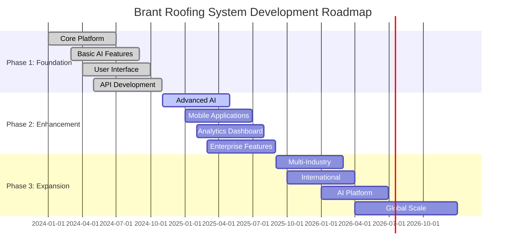

# Brant Roofing System - Development Roadmap

## 🗺️ Roadmap Overview

This roadmap outlines the strategic development plan for the Brant Roofing System over the next 3 years, focusing on innovation, scalability, and market expansion.

## 🎯 Strategic Goals

### **Vision Statement**

To become the global leader in AI-powered construction estimation, revolutionizing how the industry measures, estimates, and manages roofing projects.

### **Mission Statement**

To provide accurate, efficient, and intelligent estimation solutions that empower roofing professionals to deliver superior results while reducing costs and improving customer satisfaction.

## 📅 Timeline Overview

## 🚀 Phase 1: Foundation (Q1-Q4 2024)

### **Q1 2024: Core Platform Development**

- **✅ Completed**: Basic FastAPI backend architecture
- **✅ Completed**: PostgreSQL database design
- **✅ Completed**: Google Cloud integration
- **✅ Completed**: Document upload and processing pipeline
- **✅ Completed**: Basic measurement extraction

### **Q2 2024: AI Integration**

- **✅ Completed**: Google Document AI integration
- **✅ Completed**: Anthropic Claude integration
- **✅ Completed**: Basic measurement accuracy validation
- **✅ Completed**: Confidence scoring system

### **Q3 2024: User Interface**

- **✅ Completed**: Web application frontend
- **✅ Completed**: Document upload interface
- **✅ Completed**: Results visualization
- **✅ Completed**: Basic reporting features

### **Q4 2024: API & Integration**

- **✅ Completed**: RESTful API development
- **✅ Completed**: Authentication and authorization
- **✅ Completed**: Rate limiting and security
- **✅ Completed**: Basic third-party integrations

## 🔧 Phase 2: Enhancement (Q1-Q4 2025)

### **Q1 2025: Advanced AI Features**

- **🎯 Target**: Enhanced measurement accuracy (98%+)
- **🎯 Target**: Multi-document processing
- **🎯 Target**: 3D roof modeling
- **🎯 Target**: Weather impact analysis
- **🎯 Target**: Material optimization recommendations

#### **Key Features**

- **3D Visualization**: Interactive 3D roof models
- **Advanced OCR**: Handwriting recognition
- **Smart Validation**: Cross-reference multiple measurements
- **Predictive Analytics**: Cost trend analysis
- **Quality Assurance**: Automated error detection

### **Q2 2025: Mobile Applications**

- **🎯 Target**: Native iOS and Android apps
- **🎯 Target**: Offline processing capabilities
- **🎯 Target**: Camera integration for on-site photos
- **🎯 Target**: GPS-based project location tracking
- **🎯 Target**: Push notifications for status updates

#### **Mobile Features**

- **Document Capture**: Camera-based document scanning
- **Offline Mode**: Process documents without internet
- **Field Validation**: On-site measurement verification
- **Team Collaboration**: Real-time project sharing
- **Voice Notes**: Audio annotations for projects

### **Q3 2025: Analytics & Intelligence**

- **🎯 Target**: Business intelligence dashboard
- **🎯 Target**: Predictive cost modeling
- **🎯 Target**: Market trend analysis
- **🎯 Target**: Performance benchmarking
- **🎯 Target**: Custom reporting engine

#### **Analytics Features**

- **Executive Dashboard**: High-level business metrics
- **Project Analytics**: Individual project insights
- **Cost Analysis**: Material and labor cost trends
- **Efficiency Metrics**: Processing time and accuracy
- **ROI Calculator**: Return on investment analysis

### **Q4 2025: Enterprise Features**

- **🎯 Target**: Multi-tenant architecture
- **🎯 Target**: Advanced user management
- **🎯 Target**: Custom workflow automation
- **🎯 Target**: Enterprise security features
- **🎯 Target**: White-label solutions

#### **Enterprise Capabilities**

- **Multi-Tenancy**: Isolated customer environments
- **SSO Integration**: Single sign-on support
- **Advanced Permissions**: Granular access control
- **Audit Logging**: Comprehensive activity tracking
- **Custom Branding**: White-label customization

## 🌍 Phase 3: Expansion (Q1-Q4 2026)

### **Q1 2026: Multi-Industry Expansion**

- **🎯 Target**: Siding and exterior cladding
- **🎯 Target**: Windows and doors
- **🎯 Target**: Gutters and downspouts
- **🎯 Target**: Solar panel installation
- **🎯 Target**: General construction estimation

#### **New Industries**

- **Siding Contractors**: Vinyl, wood, and composite siding
- **Window Companies**: Replacement and new installation
- **Solar Installers**: Panel layout and roof assessment
- **General Contractors**: Multi-trade estimation
- **Insurance Adjusters**: Property damage assessment

### **Q2 2026: International Expansion**

- **🎯 Target**: European market entry
- **🎯 Target**: Asia-Pacific expansion
- **🎯 Target**: Latin American markets
- **🎯 Target**: Multi-language support
- **🎯 Target**: Local regulatory compliance

#### **Global Features**

- **Multi-Language**: 10+ language support
- **Currency Support**: Local currency pricing
- **Regulatory Compliance**: Local building codes
- **Cultural Adaptation**: Region-specific features
- **Local Partnerships**: Regional service providers

### **Q3 2026: AI Platform Development**

- **🎯 Target**: Open AI platform
- **🎯 Target**: Third-party developer tools
- **🎯 Target**: Custom model training
- **🎯 Target**: API marketplace
- **🎯 Target**: Partner ecosystem

#### **Platform Features**

- **Developer Portal**: Comprehensive API documentation
- **SDK Libraries**: Multiple programming languages
- **Custom Models**: Industry-specific AI training
- **Marketplace**: Third-party integrations
- **Community**: Developer support and forums

### **Q4 2026: Global Scale**

- **🎯 Target**: 100,000+ active users
- **🎯 Target**: 1M+ documents processed monthly
- **🎯 Target**: 50+ countries served
- **🎯 Target**: 95%+ customer satisfaction
- **🎯 Target**: Market leadership position

## 🔬 Technology Roadmap

### **AI/ML Advancements**

- **2024**: Basic OCR and measurement extraction
- **2025**: Advanced computer vision and 3D modeling
- **2026**: Predictive analytics and autonomous processing

### **Infrastructure Scaling**

- **2024**: Single-region deployment
- **2025**: Multi-region redundancy
- **2026**: Global edge computing

### **Integration Ecosystem**

- **2024**: Basic API and webhooks
- **2025**: Advanced integrations and automation
- **2026**: Comprehensive partner ecosystem

## 📊 Success Metrics

### **Phase 1 Metrics (2024)**

- **Users**: 1,000+ active users
- **Documents**: 10,000+ processed monthly
- **Accuracy**: 95%+ measurement accuracy
- **Satisfaction**: 90%+ customer satisfaction

### **Phase 2 Metrics (2025)**

- **Users**: 10,000+ active users
- **Documents**: 100,000+ processed monthly
- **Accuracy**: 98%+ measurement accuracy
- **Satisfaction**: 95%+ customer satisfaction

### **Phase 3 Metrics (2026)**

- **Users**: 100,000+ active users
- **Documents**: 1,000,000+ processed monthly
- **Accuracy**: 99%+ measurement accuracy
- **Satisfaction**: 98%+ customer satisfaction

## 🎯 Key Milestones

### **2024 Milestones**

- **Q1**: ✅ Core platform launch
- **Q2**: ✅ AI integration complete
- **Q3**: ✅ Web application launch
- **Q4**: ✅ API platform ready

### **2025 Milestones**

- **Q1**: Advanced AI features
- **Q2**: Mobile applications launch
- **Q3**: Analytics dashboard
- **Q4**: Enterprise features

### **2026 Milestones**

- **Q1**: Multi-industry expansion
- **Q2**: International markets
- **Q3**: AI platform launch
- **Q4**: Global market leadership

## 🔄 Continuous Improvement

### **Monthly Reviews**

- **Performance Metrics**: System performance and reliability
- **User Feedback**: Customer satisfaction and feature requests
- **Market Analysis**: Competitive landscape and opportunities
- **Technology Updates**: Latest AI/ML advancements

### **Quarterly Planning**

- **Feature Prioritization**: Roadmap adjustments based on feedback
- **Resource Allocation**: Team and budget optimization
- **Market Strategy**: Go-to-market plan updates
- **Partnership Development**: Strategic alliance opportunities

### **Annual Strategy**

- **Vision Alignment**: Ensure roadmap supports company vision
- **Market Position**: Competitive analysis and positioning
- **Technology Evolution**: Emerging technology integration
- **Global Expansion**: International market strategy

## 🤝 Stakeholder Engagement

### **Internal Stakeholders**

- **Development Team**: Technical roadmap and resource planning
- **Product Management**: Feature prioritization and user needs
- **Sales & Marketing**: Go-to-market strategy and positioning
- **Customer Success**: User adoption and satisfaction

### **External Stakeholders**

- **Customers**: Feature requests and feedback
- **Partners**: Integration opportunities and collaboration
- **Investors**: Growth metrics and market expansion
- **Industry**: Thought leadership and standards

---

**Last Updated**: January 2025  
**Version**: 1.0.0  
**Document Owner**: Brant Roofing System Development Team
